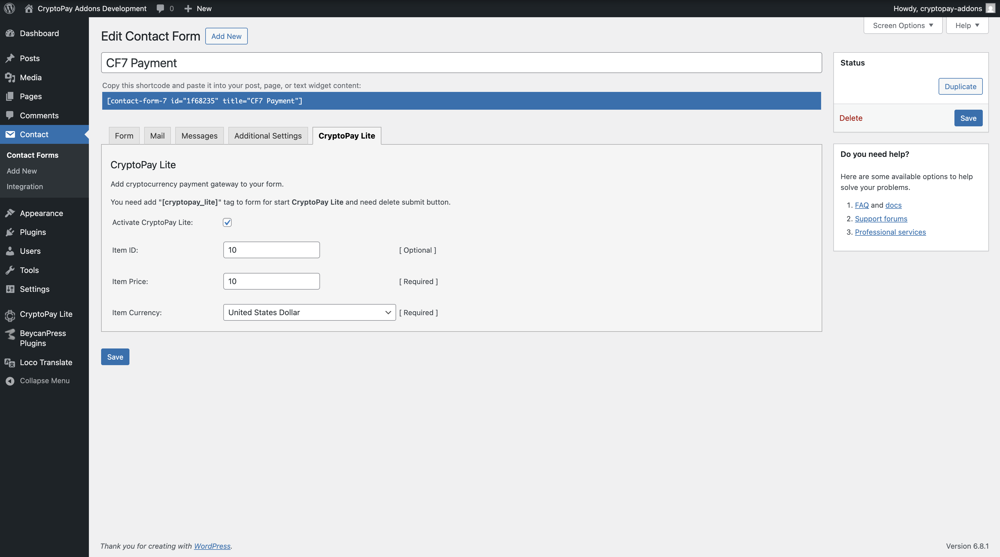
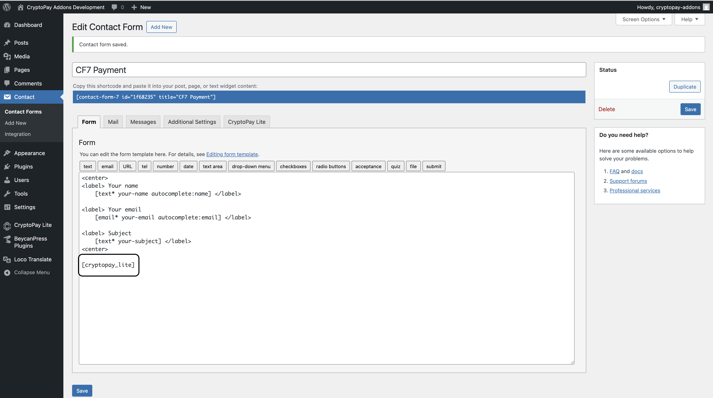
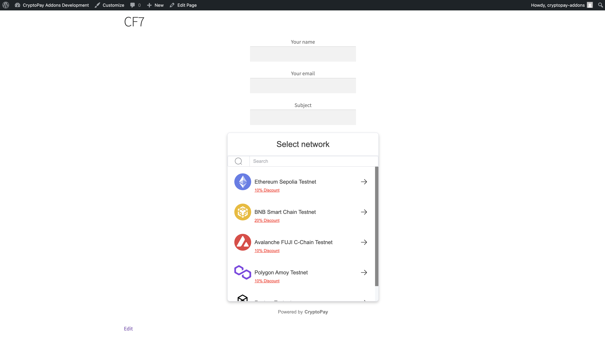
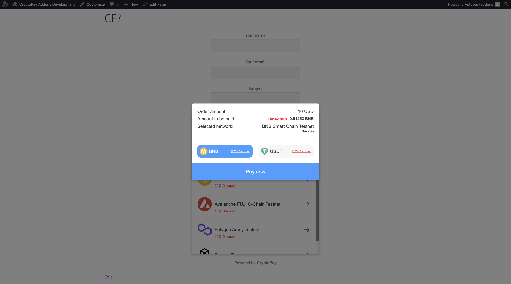

## Cryptocurrency Payment Gateway for Contact Form 7 by CryptoPay

### What does this plugin do?

As blockchain and digital currencies become more mainstream, many businesses and creators are looking for ways to accept crypto payments. If you're using Contact Form 7 on your WordPress website and want to accept cryptocurrency payments without relying on third-party processors, this plugin is made for you.

This add-on allows you to easily embed a decentralized, fee-free crypto payment system into your Contact Form 7 forms using CryptoPay.

### How does it work?

This plugin is an extension of the CryptoPay platform, so you’ll need to have either the free (Lite) or premium version of CryptoPay installed and active on your WordPress site. You’ll also need Contact Form 7 to be installed and activated.

Once everything is set up, you can enable CryptoPay as a payment option in your form configuration. From there, users can make crypto payments directly through your Contact Form 7 forms—simply and securely.

### Usage

* First, enable the CryptoPay from the tab.

* Add the CryptoPay short code to your form.

* Everything is ready, now you can test the form.

